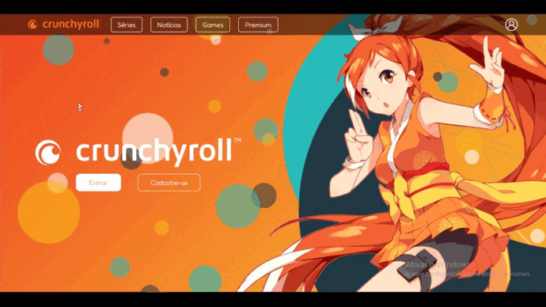

# Crunchyroll Landing Page

## About

This is a landing page based on a streaming website called "Crunchyroll". I made sure to build it in order to have more useful features in only one place.

## Overview

## Sections

## Mobile Version

## Made Using
<ul>
<li>HTML</li>
<li>CSS</li>
</ul>

## How to Run
Make sure "Git" is installed in your PC!

    git clone https://github.com/Bruno-Messias-B-S/Crunchyroll-Landingpage.git

## Made By
[Bruno Messias](https://www.linkedin.com/in/bruno-messias-bs/)